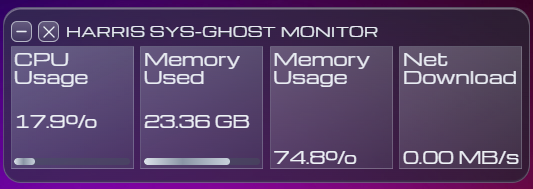

# SYS-GHOST Monitor

一款輕量、常駐桌面頂層的系統資源監控小工具，以 **Tauri v2 + Angular + Rust** 打造，UI 採用半透明毛玻璃風格，盡可能不干擾工作流程。

## 預覽



## 功能

| 指標 | 說明 |
|------|------|
| CPU Usage | 即時全核心平均使用率（%） |
| Memory Used | 已使用實體記憶體（GB） |
| Memory Usage | 記憶體使用百分比（%） |
| Net Download | 即時網路下載速率（MB/s） |

- 資料每秒更新一次
- 無邊框透明視窗，固定置頂
- 可拖曳標題列移動視窗位置
- 最小化 / 關閉按鈕

## 技術棧

| 層級 | 技術 |
|------|------|
| 前端框架 | Angular 20 |
| 桌面容器 | Tauri v2 |
| 後端 / 系統資訊 | Rust + [sysinfo](https://crates.io/crates/sysinfo) |
| 前後端通訊 | Tauri Event（`system-stats` 每秒 emit） |
| 字型 | Michroma (Google Fonts) |

## 開發環境需求

- [Node.js](https://nodejs.org/) 18+
- [Rust](https://rustup.rs/) (stable)
- [Tauri CLI prerequisites](https://tauri.app/start/prerequisites/)

## 快速開始

```bash
# 安裝前端相依套件
npm install

# 啟動開發模式（同時啟動 Angular dev server 與 Tauri 視窗）
npm run tauri dev
```

## 建置

```bash
# 建置可發佈的桌面應用程式
npm run tauri build
```

產出檔案位於 `src-tauri/target/release/`。

## 專案結構

```
sys-ghost/
├── src/                        # Angular 前端
│   └── app/
│       ├── app.component.ts    # 主元件（拖曳、關閉、最小化）
│       ├── app.component.html  # 版面模板
│       ├── app.component.css   # 樣式（毛玻璃 UI）
│       └── system-monitor.service.ts  # 訂閱 Tauri 系統事件
├── src-tauri/                  # Rust 後端
│   ├── src/lib.rs              # 系統資訊採集 & Tauri 事件 emit
│   ├── capabilities/           # Tauri 權限設定
│   └── tauri.conf.json         # 視窗設定（透明、置頂、無邊框）
└── docs/
    └── preview.png
```

## 推薦 IDE 設定

[VS Code](https://code.visualstudio.com/) +
[Tauri](https://marketplace.visualstudio.com/items?itemName=tauri-apps.tauri-vscode) +
[rust-analyzer](https://marketplace.visualstudio.com/items?itemName=rust-lang.rust-analyzer) +
[Angular Language Service](https://marketplace.visualstudio.com/items?itemName=Angular.ng-template)
